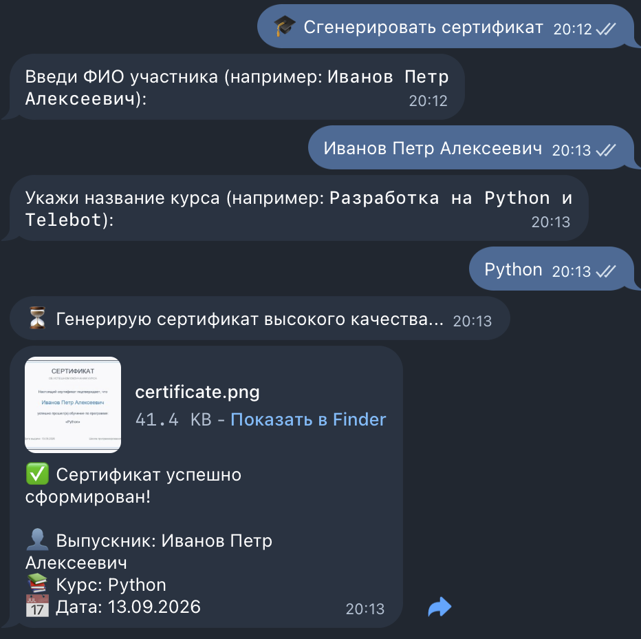

# 🎓 Telegram Bot: Генератор сертификатов (Pillow)

Интерактивный Telegram-бот для автоматического создания персонализированных графических сертификатов и дипломов «на лету».

## 📸 Демонстрация работы

*Пример сгенерированного сертификата:*

## 🛠 Технологии и стек
- **Python 3.10+**
- **pyTelegramBotAPI (telebot)** — пошаговый диалог и отправка медиафайлов
- **Pillow (PIL)** — динамический рендеринг графики, работа с шрифтами и экспорт в оперативную память (`BytesIO`)

## 🌟 Основные возможности
- 📝 **Персонализация:** Ввод имени пользователя и названия курса через чат.
- 🎨 **Графический движок:** Автоматическая отрисовка рамки, шрифтов и текста.
- ⚡ **Мгновенная доставка:** Отправка готового документа в виде фото без сохранения мусора на сервере.
